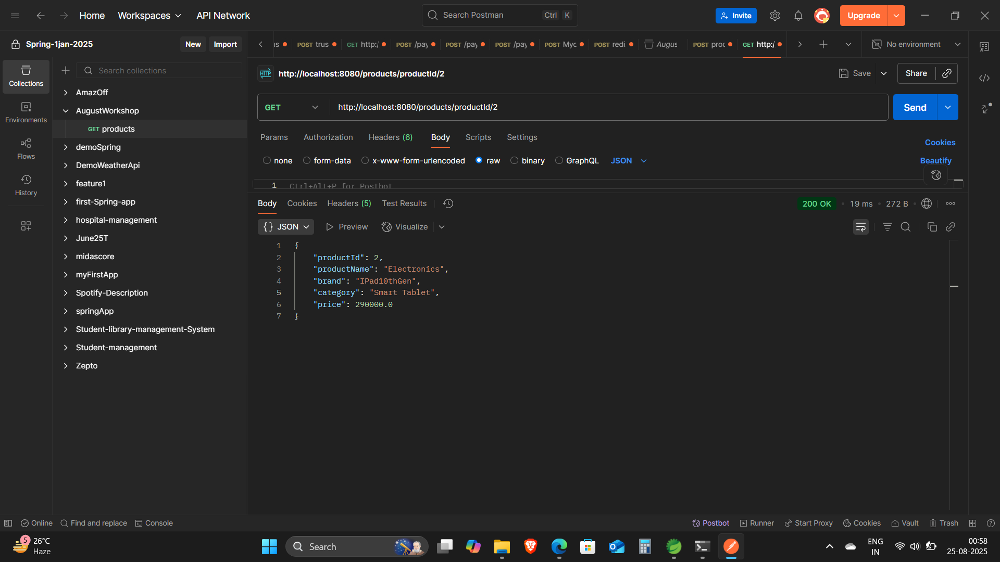

# Spring Product App JPA

This is a Spring Boot application demonstrating CRUD operations with JPA and MySQL.

## Features
- Add, update, get products by ID
- For Post Api -http://localhost:8080/products
- For Put Api -http://localhost:8080/products When updating give id
- For GET API -http://localhost:8080/products/productId/{productID}
- For GETALL API -http://localhost:8080/products
- List all products
- REST API endpoints tested with Postman

## Screenshots

### Add Product

### Get Product By ID

### Get All Products

### MySQL Product Table

